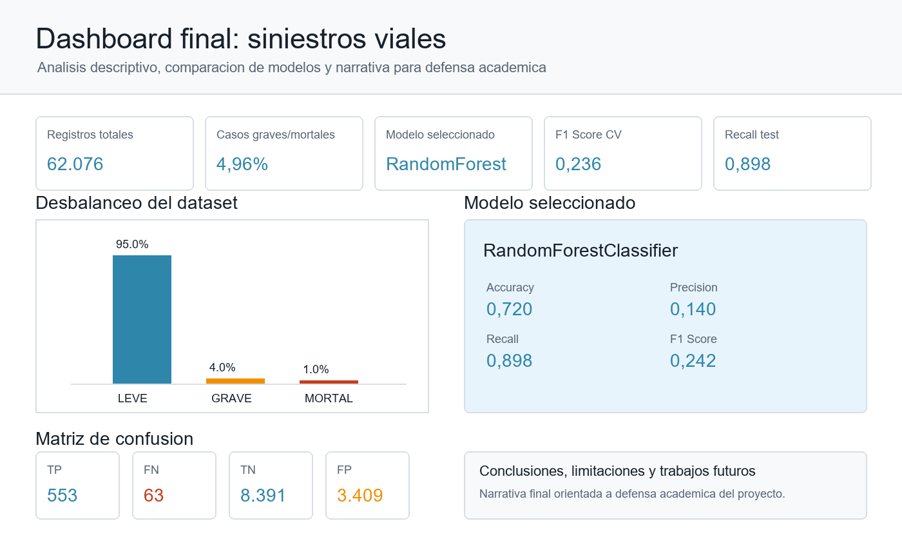

# 🚦 Predicción y Análisis de Siniestros Viales

## 📌 Resumen Ejecutivo

Este proyecto aborda la predicción de gravedad en siniestros viales a partir de un dataset administrativo de víctimas y hechos de tránsito. El flujo desarrollado incluye EDA, limpieza, enriquecimiento, definición de target, entrenamiento, comparación de modelos y validación cruzada. El problema se formuló como una clasificación binaria para detectar casos graves o mortales. El modelo seleccionado fue `RandomForestClassifier`, por su mejor equilibrio entre F1 Score, Recall y estabilidad. Los resultados se documentan en artefactos JSON, se persisten en Firestore y se comunican mediante un dashboard final. La ejecución completa quedó automatizada con Papermill a través de `scripts/run_pipeline.py`.

Trabajo práctico final universitario de Ciencia de Datos orientado al análisis, procesamiento, modelado predictivo, persistencia y comunicación de resultados sobre un dataset de siniestros viales.

El proyecto implementa un flujo completo de trabajo: análisis exploratorio, limpieza, enriquecimiento de datos, definición de hipótesis, construcción del target, entrenamiento de modelos, comparación de desempeño, validación cruzada, persistencia de resultados en Firestore, generación de dashboard final, logging, auditoría y automatización con Papermill.

## 🎯 Objetivo General

Desarrollar una solución de Ciencia de Datos que permita analizar siniestros viales y construir modelos predictivos capaces de anticipar la ocurrencia de casos graves o mortales a partir de información disponible sobre la víctima y el contexto del hecho.

## 🔍 Hipótesis de Trabajo

A partir del análisis exploratorio se planteó la hipótesis de que ciertas características de la víctima, su rol dentro del siniestro y el modo de desplazamiento permiten anticipar parcialmente la probabilidad de que el hecho derive en consecuencias graves o mortales.

Para contrastar esta hipótesis se construyó un problema de clasificación supervisada binaria, agrupando las categorías `GRAVE` y `MORTAL` como clase positiva y `LEVE` como clase negativa.

## ✅ Estado Actual del Proyecto

El proyecto se encuentra finalizado y listo para entrega académica. Incluye:

- EDA.
- Limpieza de datos.
- Enriquecimiento del dataset.
- Formulación de hipótesis.
- Definición del target predictivo.
- Entrenamiento de modelos.
- Comparación de modelos.
- Cross Validation.
- Persistencia en Firestore.
- Dashboard final de storytelling.
- Logging del pipeline.
- Auditoría de reproducibilidad.
- Automatización con Papermill.

## 🧭 Data Understanding y Diccionario de Datos

El proyecto incorpora el diccionario oficial del dataset **Siniestros viales**, publicado por Buenos Aires Data a través de la Secretaría de Transporte, la Subsecretaría de Planificación de la Movilidad y el Observatorio de Movilidad y Seguridad Vial de la Ciudad Autónoma de Buenos Aires.

La documentación completa se encuentra en:

```text
docs/data_dictionary.md
```

Puntos conceptuales relevantes:

- `SD` se interpreta como **Sin Datos**. No debe tratarse como una categoría sustantiva del fenómeno vial.
- `gravedad_victima` representa la severidad de la lesión y se considera una variable ordinal: `LEVE < GRAVE < MORTAL`.
- `LEVE` identifica personas lesionadas con alta médica dentro de las 24 horas siguientes al siniestro o hechos sin datos sobre gravedad de lesiones.
- `GRAVE` identifica lesiones que exigen hospitalización de al menos 24 horas o atención especializada.
- `MORTAL` identifica víctimas que fallecen dentro de los 30 días de producido el siniestro vial por causas directa o indirectamente atribuibles al hecho.
- Las categorías de `modo_desplazamiento_victima` y `rol_victima` tienen semántica de dominio y no deben interpretarse solo por su etiqueta textual.

El uso del diccionario de datos aporta trazabilidad conceptual, reduce riesgos de interpretación y permite justificar decisiones de limpieza, codificación y modelado.

## 🛠️ Tecnologías Utilizadas

- Python.
- Pandas.
- NumPy.
- Matplotlib.
- Seaborn.
- Plotly.
- Scikit-learn.
- Firebase.
- Firestore.
- Papermill.
- Jupyter Notebook.
- Joblib.

## 📁 Estructura del Repositorio

```text
tp-final-siniestros-viales/
├── data/
│   ├── raw/                         # Datos originales sin modificar
│   └── processed/                   # Datasets limpios y enriquecidos
├── docs/
│   ├── data_dictionary.md           # Diccionario de datos y criterios de dominio
│   └── dashboard_preview.png        # Vista previa del dashboard final
├── logs/
│   └── pipeline.log                 # Registro de ejecución del pipeline
├── notebooks/
│   ├── 01_eda.ipynb
│   ├── 02_preprocessing.ipynb
│   ├── 03_analisis.ipynb
│   ├── 04_modelado.ipynb
│   ├── 05_entrenamiento.ipynb
│   ├── 06_comparacion_modelos.ipynb
│   ├── 07_cross_validation.ipynb
│   ├── 08_firebase.ipynb
│   └── 09_dashboard_storytelling.ipynb
├── outputs/
│   ├── dashboards/                  # Dashboard HTML final
│   ├── executed_notebooks/          # Notebooks ejecutados por Papermill
│   ├── figures/                     # Figuras exportadas
│   ├── model_comparison.json
│   ├── model_metrics.json
│   ├── cross_validation_results.json
│   ├── pipeline_audit_report.md
│   └── pipeline_execution_report.json
├── scripts/
│   ├── run_pipeline.py              # Automatización completa con Papermill
│   └── upload_results_firebase.py   # Persistencia de resultados en Firestore
├── src/
├── README.md
└── requirements.txt
```

## 📊 Pipeline del Proyecto

```text
01_eda.ipynb
↓
02_preprocessing.ipynb
↓
03_analisis.ipynb
↓
04_modelado.ipynb
↓
05_entrenamiento.ipynb
↓
06_comparacion_modelos.ipynb
↓
07_cross_validation.ipynb
↓
08_firebase.ipynb
↓
09_dashboard_storytelling.ipynb
```

Función de cada etapa:

- `01_eda.ipynb`: realiza la exploración inicial del dataset, identifica estructura, variables relevantes, valores faltantes y patrones preliminares.
- `02_preprocessing.ipynb`: limpia, normaliza y enriquece el dataset sin modificar los datos originales ubicados en `data/raw/`.
- `03_analisis.ipynb`: desarrolla análisis descriptivo y validación de hipótesis sobre la gravedad de los siniestros.
- `04_modelado.ipynb`: define el enfoque predictivo, el target binario y las variables candidatas para modelado.
- `05_entrenamiento.ipynb`: entrena el primer modelo y exporta métricas base en `outputs/model_metrics.json`.
- `06_comparacion_modelos.ipynb`: compara distintos algoritmos y genera `outputs/model_comparison.json`.
- `07_cross_validation.ipynb`: evalúa estabilidad y generalización mediante validación cruzada, generando `outputs/cross_validation_results.json`.
- `08_firebase.ipynb`: construye y valida payloads para persistir resultados en Firestore.
- `09_dashboard_storytelling.ipynb`: genera el dashboard final con narrativa académica, visualizaciones, matriz de confusión y conclusiones.

## 🤖 Modelo Seleccionado

El modelo final seleccionado fue:

```text
RandomForestClassifier
```

La selección se basó en el mejor equilibrio entre F1 Score, Recall, Precision y estabilidad en Cross Validation. En un problema con fuerte desbalanceo de clases, Accuracy no resulta suficiente como criterio principal, por lo que se priorizaron métricas asociadas a la detección de casos graves o mortales.

Métricas en conjunto de test:

| Modelo | Accuracy | Precision | Recall | F1 Score |
|---|---:|---:|---:|---:|
| RandomForestClassifier | 0.720 | 0.140 | 0.898 | 0.242 |

Métricas en Cross Validation:

| Métrica | Media | Desvío estándar |
|---|---:|---:|
| Accuracy | 0.719 | 0.006 |
| Precision | 0.136 | 0.001 |
| Recall | 0.874 | 0.018 |
| F1 Score | 0.236 | 0.002 |

El modelo obtuvo el mejor F1 Score promedio entre los modelos evaluados y mantuvo baja variabilidad entre folds, lo que indica una mejor estabilidad relativa de generalización. Además, su Recall elevado muestra una fuerte capacidad para detectar casos graves o mortales, criterio especialmente importante en el contexto del problema.

## 🏆 Resultados Principales

| Indicador | Valor |
|---|---:|
| Registros analizados | 62.076 |
| Casos graves o mortales | 4,96% |
| Modelo ganador | RandomForestClassifier |
| Accuracy | 0,720 |
| Recall | 0,898 |
| F1 Score | 0,242 |
| Verdaderos Positivos | 553 |
| Falsos Negativos | 63 |

Los resultados muestran que es posible anticipar parcialmente la gravedad de un siniestro vial utilizando información disponible sobre la víctima y el contexto del hecho. El modelo seleccionado logró detectar la mayoría de los casos graves o mortales manteniendo un comportamiento estable durante la validación cruzada.

## 🔎 Hallazgos Relevantes

El análisis permitió identificar un fuerte desbalanceo del dataset, con predominio de casos leves y una proporción reducida de eventos graves o mortales. Esta característica condiciona la interpretación de métricas agregadas como Accuracy y justifica el uso de Recall y F1 Score como criterios centrales de evaluación.

También se observó que variables asociadas al modo de desplazamiento y al rol de la víctima aportan información relevante para caracterizar situaciones de mayor riesgo. Las diferencias entre grupos vulnerables sugieren que la exposición vial no es homogénea y que determinados perfiles pueden concentrar una mayor proporción relativa de consecuencias severas.

Desde una perspectiva aplicada, el proyecto destaca la importancia de minimizar falsos negativos, ya que no detectar un caso potencialmente grave representa un costo mayor que generar alertas adicionales para revisión.

## 🔥 Firebase y Firestore

La etapa de Firebase persiste resultados ya generados. No reentrena modelos y no modifica `data/raw/`.

Firebase es la plataforma de backend de Google que provee servicios como autenticación, hosting y bases de datos. Firestore es la base de datos NoSQL documental dentro de Firebase y Google Cloud. En este proyecto se usa Firestore porque los resultados de experimentos de Machine Learning son documentos semiestructurados: metadata del dataset, métricas, validación cruzada, configuración del modelo y eventos de auditoría.

La persistencia en Firestore aporta:

- Trazabilidad del experimento ejecutado.
- Reproducibilidad de resultados a partir de artefactos versionados.
- Auditoría de métricas, configuración del modelo, features y dataset utilizado.
- Comparabilidad entre futuras iteraciones del pipeline.

Configurar credenciales locales:

1. Crear una cuenta de servicio en Firebase o Google Cloud con permisos de Firestore.
2. Descargar el JSON de credenciales en una ruta local segura.
3. Copiar `.env.example` como `.env`.
4. Completar las variables:

```env
FIREBASE_CREDENTIALS_PATH=<ruta-local-al-service-account.json>
FIREBASE_PROJECT_ID=nombre-del-proyecto-firebase
```

El archivo `.env` está ignorado por Git. No se deben subir credenciales ni service accounts al repositorio.

Validar payloads sin escribir en Firestore:

```bash
python scripts/upload_results_firebase.py --dry-run
```

Ejecutar la carga real a Firestore:

```bash
python scripts/upload_results_firebase.py
```

También se puede revisar esta etapa desde:

```text
notebooks/08_firebase.ipynb
```

Colecciones creadas en Firestore:

- `datasets`: documento `siniestros_limpio_enriquecido` con metadata del dataset limpio y preprocesado, incluyendo cantidad de filas y columnas, tipos de datos, nulos por columna, ruta local del CSV procesado, versión, hash SHA-256, fecha de ejecución y muestra parcial.
- `model_results`: documento `modelo_ganador` con métricas holdout, métricas de Cross Validation, matriz de comparación, features usadas, target, criterio de selección y modelo elegido.
- `model_config`: documento `configuracion_modelo_ganador` con configuración del experimento, modelos evaluados, target, features numéricas y categóricas, exclusiones por leakage, preprocesamiento, `class_weight`, `random_state`, estrategia de Cross Validation y hash del dataset.
- `predictions`: documento `predicciones_experimento_actual` con resumen de predicciones disponible en artefactos existentes, matriz de confusión, classification report, filas de test y tasa positiva.
- `pipeline_logs`: documento `eventos` y subcolección `items` con eventos de auditoría de inicio y fin del proceso.

El log local de esta etapa queda disponible en:

```text
logs/pipeline.log
```

## 📈 Dashboard Final

El dashboard final de storytelling se genera desde:

```text
notebooks/09_dashboard_storytelling.ipynb
```

El archivo HTML exportado se almacena automáticamente en:

```text
outputs/dashboards/dashboard_siniestros.html
```

## 📈 Vista Previa del Dashboard



La vista previa resume la estructura del dashboard final: KPIs principales, análisis del desbalanceo, desempeño del modelo ganador, matriz de confusión y narrativa de conclusiones. El archivo completo e interactivo se encuentra en `outputs/dashboards/dashboard_siniestros.html`.

El dashboard incluye:

- KPIs principales del proyecto.
- Análisis descriptivo de la gravedad de las víctimas.
- Análisis del desbalanceo del dataset.
- Composición de gravedad por grupo etario.
- Composición de gravedad por vulnerabilidad del usuario.
- Evolución temporal mensual de siniestros.
- Comparación de métricas por modelo.
- Resultados de Cross Validation.
- Matriz de confusión del modelo ganador.
- Interpretación de falsos positivos y falsos negativos.
- Conclusiones del proyecto.
- Limitaciones metodológicas.
- Trabajos futuros.

Figura exportada asociada a la evaluación del modelo:

```text
outputs/figures/confusion_matrix_random_forest.png
```

## 🔄 Reproducibilidad

El pipeline completo puede ejecutarse mediante un único comando:

```bash
python scripts/run_pipeline.py
```

El script ejecuta secuencialmente los notebooks del proyecto mediante Papermill, utilizando kernel fresco para cada etapa y guardando las versiones ejecutadas en:

```text
outputs/executed_notebooks/
```

La ejecución automatizada realiza:

- Ejecución completa de notebooks.
- Generación de datasets procesados.
- Generación de métricas y artefactos JSON.
- Construcción de payloads para Firestore.
- Actualización de Firestore cuando las credenciales están configuradas y la carga está habilitada.
- Generación del dashboard HTML final.
- Registro de logs en `logs/pipeline.log`.
- Generación de reporte de ejecución en `outputs/pipeline_execution_report.json`.

Reporte de auditoría de notebooks:

```text
outputs/pipeline_audit_report.md
```

Reporte de ejecución automatizada:

```text
outputs/pipeline_execution_report.json
```

Para usar un kernel específico en la automatización, se puede definir:

```bash
PIPELINE_KERNEL_NAME=nombre_del_kernel
```

## ⚙️ Instalación

Clonar el repositorio:

```bash
git clone <url-del-repositorio>
cd tp-final-siniestros-viales
```

Crear y activar un entorno virtual:

```bash
python -m venv .venv
```

En Windows:

```bash
.\.venv\Scripts\activate
```

En Linux/macOS:

```bash
source .venv/bin/activate
```

Instalar dependencias:

```bash
pip install -r requirements.txt
```

Colocar el dataset original en:

```text
data/raw/
```

Ejecutar el pipeline completo:

```bash
python scripts/run_pipeline.py
```

## 📦 Artefactos Principales

| Artefacto | Descripción |
|---|---|
| `data/processed/siniestros_limpio_enriquecido.csv` | Dataset limpio y enriquecido utilizado para análisis y modelado. |
| `outputs/model_metrics.json` | Métricas del entrenamiento base. |
| `outputs/model_comparison.json` | Comparación de modelos y selección preliminar. |
| `outputs/cross_validation_results.json` | Resultados de validación cruzada. |
| `outputs/dashboards/dashboard_siniestros.html` | Dashboard final del proyecto. |
| `outputs/figures/confusion_matrix_random_forest.png` | Matriz de confusión del modelo ganador. |
| `docs/dashboard_preview.png` | Vista previa del dashboard para documentación. |
| `outputs/pipeline_audit_report.md` | Informe de auditoría de notebooks. |
| `outputs/pipeline_execution_report.json` | Reporte de ejecución automatizada con Papermill. |
| `logs/pipeline.log` | Log consolidado del pipeline. |

## 🎓 Aprendizajes del Proyecto

El desarrollo del proyecto permitió consolidar aprendizajes centrales para un flujo de Ciencia de Datos reproducible. El EDA resultó fundamental para comprender la estructura del dataset, detectar desbalanceo de clases y orientar la construcción del target. La calidad de datos y la interpretación del diccionario oficial fueron claves para evitar decisiones de modelado conceptualmente débiles.

El feature engineering permitió transformar variables administrativas en insumos analíticos más útiles para el modelo. La validación cruzada aportó una evaluación más robusta de la estabilidad del desempeño, mientras que Firestore incorporó trazabilidad y auditoría de experimentos. Finalmente, la automatización con Papermill permitió convertir notebooks exploratorios en un pipeline ejecutable, reproducible y documentado.

## 🚀 Trabajos Futuros

- Análisis geográfico.
- Incorporación de variables climáticas.
- Validación temporal.
- Técnicas específicas para datasets desbalanceados.
- Modelos avanzados como XGBoost y LightGBM.
- Despliegue mediante API.

## 👥 Autores

Completar con los integrantes del grupo antes de la entrega.

- Nombre Apellido.
- Nombre Apellido.
